# TruInterview: AI Multimodal Technical Interviewer

TruInterview is a robust, interactive, web-based technical assessment platform. It leverages **Gemini 3.5 Flash** and **TruGen.ai** to deliver real-time audio/video interviews, monitor candidate screen sharing, evaluate code submissions via AI vision, administer interactive multiple-choice tests, and generate comprehensive scoring reports.

The application follows a lightweight, server-side design pattern requiring **no build or compilation step**, utilizing standard vanilla web technologies (HTML5, Vanilla CSS3, ES6+ JavaScript, PHP, and PostgreSQL) for direct execution.

---

## 🌟 Key Features

*   **Real-Time Multimodal Interview Agent**: Live audio and video conversational interview flow powered by a TruGen AI agent iframe, accompanied by a dynamic audio waveform visualizer and localized candidate webcam PiP overlay.
*   **Intelligent Screen Context Sharing**: Periodic passive screen capturing (every 9 seconds) or active "Submit Code" snapshotting. The application merges screen contents and webcam inputs into a single high-resolution frame before uploading.
*   **Interactive MCQ Assessment**: Dynamically shifts status to trigger multiple-choice questions. Uses Gemini to classify voice intents for reading preferences (e.g., read aloud vs. self-read) and to extract selected options (A, B, C, or D) from candidate utterances.
*   **Dual-Theme Premium Dashboard**: Immersive, glassmorphism-inspired layout featuring a "Dark Tech" default theme and a "Clean Light" alternative theme. Includes a skeleton loading system for smooth visual states.
*   **Automated Evaluation Reports**: Post-interview analysis detailing Communication, Problem Solving, and Code Quality metrics (graded 1–10) alongside key strengths, development areas, and a synthesized feedback summary generated by Gemini.

---

## 🛠️ Technology Stack

*   **Frontend**: HTML5, Vanilla CSS3 (Custom Properties/Variables, CSS Grid, Flexbox, custom keyframes), Vanilla JavaScript (ES6, MediaDevices API, Canvas API for picture-in-picture stream compositions).
*   **Backend**: PHP 7.4+ (cURL integration client for Gemini APIs and TruGen SDK actions, webhooks controller, database connectivity layer).
*   **Database**: PostgreSQL 12+ (stores session state machine variables, conversation transcripts, multiple-choice question sets, and user response telemetry).
*   **AI Models & Engines**:
    *   **Gemini 3.5 Flash**: Orchestrates natural language classification, multimodal code visual analysis, and final structured candidate report card compilation.
    *   **TruGen.ai**: Facilitates real-time low-latency video interview streams, audio transcription hook triggers, and TTS (Text-to-Speech) conversational injections.

---

## 📐 Architecture & Flow

The lifecycle of an interview session progresses through the following flow:

```mermaid
sequenceDiagram
    autonumber
    actor Candidate as Candidate (Browser)
    participant App as App Frontend
    participant Server as Backend API (PHP)
    participant DB as PostgreSQL DB
    participant Gemini as Gemini 3.5 Flash
    participant TruGen as TruGen AI Agent

    Candidate->>App: Submits Name & Email
    App->>Server: POST api.php?action=start
    Server->>DB: Create Session (Status: STARTED)
    Server-->>App: Return Session ID
    App->>TruGen: Connect Agent Iframe & Media Streams
    TruGen->>Server: Webhook: agent.started_speaking (Greet candidate)
    Server->>DB: Log Transcript
    
    loop Interview Conversation
        Candidate->>App: Shares Screen & Webcam
        App->>App: Compose Canvas (Screen + Webcam PiP)
        App->>Server: POST api.php?action=upload_frame (Passive/Active)
        Server->>App: Acknowledge Frame Uploaded
        Candidate->>TruGen: Speaks response / asks question
        TruGen->>Server: Webhook: utterance_committed
        Server->>Gemini: Query vision/chat response with screenshot context
        Gemini-->>Server: Return technical reply (lexically cleaned)
        Server->>TruGen: PUT /speak (Inject response to candidate)
    end

    rect rgb(25, 30, 45)
        note right of Candidate: MCQ Phase
        App->>Server: GET api.php?action=trigger_mcq
        Server->>DB: Update Session Status (MCQ_PROMPTING)
        Server->>TruGen: Speak MCQ preference prompt
        Candidate->>TruGen: "I want to read it myself"
        TruGen->>Server: Webhook: utterance_committed
        Server->>Gemini: Classify utterance preference
        Gemini-->>Server: Return SELF_READ
        Server->>DB: Update Preference (SILENT)
        App->>Candidate: Render MCQ options card
        Candidate->>App: Selects option & submits
        App->>Server: POST api.php?action=submit_option
        Server->>DB: Log candidate answer & correctness
        Server->>App: Render next question / complete MCQ
    end

    Candidate->>App: Clicks "End Interview"
    App->>Server: GET api.php?action=complete
    Server->>DB: Update Session Status (COMPLETED)
    Server->>TruGen: Terminate Conversation (DELETE /conversation)
    Server->>Gemini: Compile final evaluation scorecard
    Gemini-->>Server: Return structured scorecard JSON
    Server->>DB: Update final_score JSONB
    Server-->>App: Return feedback report payload
    App->>Candidate: Render Dashboard with final scores & badges
```



---

## 🗄️ Database Schema

The database setup runs automatically on load via `db.php` if tables do not exist. 

### 1. `sessions`
Tracks candidate metadata, ongoing state, and evaluation results.
*   `id` (UUID, PK): Unique identifier.
*   `candidate_name` (VARCHAR): Candidate name.
*   `email` (VARCHAR): Candidate email.
*   `current_status` (VARCHAR): Current session state (`STARTED`, `IN_PROGRESS`, `MCQ_PROMPTING`, `MCQ_ACTIVE`, `COMPLETED`).
*   `mcq_preference` (VARCHAR): User preference for MCQ reading (`PENDING`, `READ`, `SILENT`).
*   `trugen_conversation_id` (VARCHAR): Associated TruGen session ID.
*   `started_at` (TIMESTAMP): Time created.
*   `completed_at` (TIMESTAMP): Time completed.
*   `final_score` (JSONB): Evaluation score object from Gemini.

### 2. `transcripts`
Logs every turn of the conversational stream.
*   `id` (SERIAL, PK): Auto-increment ID.
*   `session_id` (UUID, FK): Associated session.
*   `speaker` (VARCHAR): Sender role (`SYSTEM`, `USER`, `AGENT`).
*   `message` (TEXT): Spoken content or system notification.
*   `timestamp` (TIMESTAMP): Event recording time.

### 3. `mcq_questions`
Static repository of technical assessment questions.
*   `id` (SERIAL, PK): Auto-increment ID.
*   `topic` (VARCHAR): Coding subject (e.g. `JavaScript`, `CSS`, `PHP`).
*   `question` (TEXT): The main question statement.
*   `option_a`, `option_b`, `option_c`, `option_d` (TEXT): Multi-choice selections.
*   `correct_option` (CHAR): Correct selection code (`A`, `B`, `C`, or `D`).

### 4. `candidate_responses`
Logs MCQ choices made by the candidate.
*   `id` (SERIAL, PK): Auto-increment ID.
*   `session_id` (UUID, FK): Associated session.
*   `question_id` (INT, FK): Associated MCQ question.
*   `selected_option` (CHAR): Selected answer option.
*   `is_correct` (BOOLEAN): Score verification flag.
*   `submitted_at` (TIMESTAMP): Time of submission.

---

## 🔌 API Endpoints (`api.php`)

All API interactions accept and return `application/json` payload types.

| Endpoint Action | Method | Query Parameters | Body Parameter | Description |
| :--- | :--- | :--- | :--- | :--- |
| `?action=start` | **POST** | *None* | `name`, `email` | Creates a new session, sets a cookie, and logs session startup. |
| `?action=status` | **GET** | `session_id` | *None* | Returns the session details and transcripts history list. |
| `?action=upload_frame` | **POST** | *None* | `session_id` (optional), `frame` (base64) | Writes candidate screenshot (`uploads/<session_id>/latest.jpg`) to disk. |
| `?action=trigger_mcq` | **GET** | `session_id` | *None* | Transitions session to MCQ prompting and speaks instructions. |
| `?action=get_mcq_state` | **GET** | `session_id` | *None* | Returns active question details if MCQ status is ongoing. |
| `?action=submit_option` | **POST** | *None* | `session_id`, `question_id`, `option` | Evaluates, logs response, and queues next question or finishes flow. |
| `?action=complete` | **GET** | `session_id` | *None* | Terminates streams and fetches final Gemini score details. |
| `?action=webhook` | **POST** | *None* | *Webhook payload* | Processes TruGen events (`agent.started_speaking`, `agent.stopped_speaking`, `utterance_committed`, `call_ended`). |

---

## ⚙️ Environment Configuration

Define a `.env` file in the root directory to store database connection details and AI service API keys:

```env
# Database Credentials
DB_HOST=127.0.0.1
DB_PORT=5432
DB_NAME=truinterview
DB_USER=your_postgres_user
DB_PASSWORD=your_postgres_password

# API Credentials
GEMINI_API_KEY=your_gemini_api_key
TRUGEN_API_KEY=your_trugen_api_key
TRUGEN_AGENT_ID=your_trugen_agent_id
```

---

## 🚀 Installation & Setup

1.  **Clone the Repository**:
    ```bash
    git clone https://github.com/your-username/truinterview.git
    cd truinterview
    ```

2.  **Configure Database**:
    Ensure PostgreSQL is running and create a database corresponding to `DB_NAME` in your `.env` configuration.
    ```sql
    CREATE DATABASE truinterview;
    ```
    *Note: The schema will be automatically generated and populated with default seed questions on the first application reload.*

3.  **Deploy Env File**:
    Create a `.env` file in the root directory utilizing the environment template keys shown in the configuration section.

4.  **Launch Server**:
    Since this is a standard PHP/JavaScript project without a compilation pipeline, host the directory using any PHP-compatible web server (e.g. Apache, Nginx, or PHP's built-in development server):
    ```bash
    php -S localhost:8000
    ```

5.  **Access App**:
    Open [http://localhost:8000](http://localhost:8000) in your browser. Enter candidate details to begin the interview.

---

## 📖 Development Guidelines

1.  **No Build Step**: Write clean HTML5, standard ES6+ JavaScript, and native CSS3 variables. Do not introduce compile dependencies.
2.  **Multimodal Integrations**: Custom prompt guidelines are mapped inside `ai_service.php`. Ensure TTS instructions filter markdown elements and emojis when sending injected speech.
3.  **Database Seeding**: Check `db.php` if additional mock MCQ questions require additions.