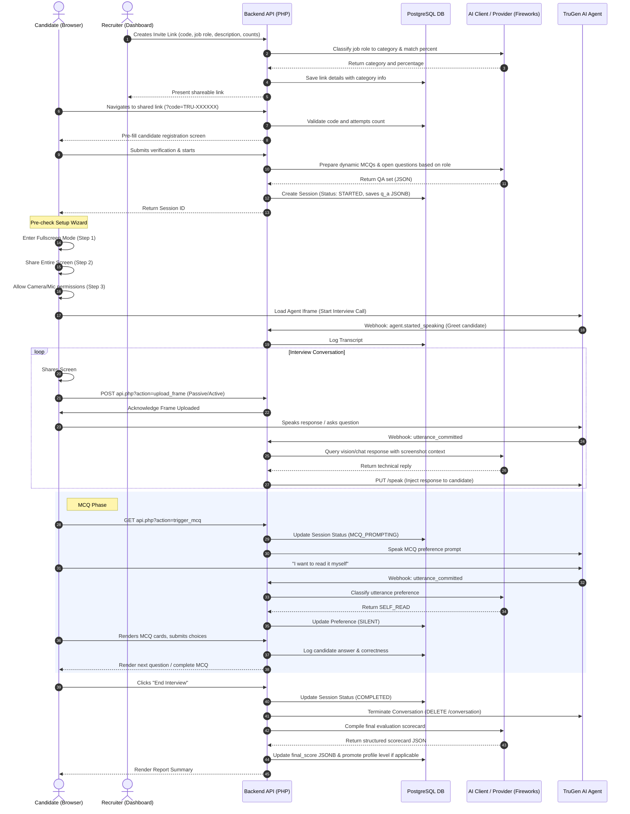

# TruInterview: AI Multimodal Technical Interviewer & Screening Platform

TruInterview is a robust, interactive, web-based technical assessment and screening platform. It leverages a **flexible, provider-agnostic AI Client** (integrated with **Fireworks AI** by default, supporting models like DeepSeek, Qwen, GLM, and Kimi via standard OpenAI-compatible endpoints) and **TruGen.ai** to deliver real-time audio interviews, monitor candidate screen sharing, evaluate code submissions via AI vision, administer interactive multiple-choice tests, and generate comprehensive evaluation dashboards for both recruiters and candidates.

The application follows a lightweight, server-side design pattern requiring **no build or compilation step**, utilizing standard vanilla web technologies (HTML5, Vanilla CSS3, ES6+ JavaScript, PHP, and PostgreSQL) for direct execution.

---

## 🌟 Key Features

*   **Premium Split-Screen Authentication**: Beautiful, full-bleed split layouts for registration and login. Features light glassmorphism styling, a "Back to Home" navigation button, role-specific dynamic backgrounds/copy, and integrated **"Sign in with Google"** OAuth with a dynamic first-time user role-selection workflow.
*   **Dual Dashboards & Role-based Access**:
    *   **Candidate Dashboard (V2)**: Features multi-profile management allowing candidates to maintain up to 3 distinct career profiles (e.g., React Developer, PHP Engineer) with independent difficulty levels, category mappings, practice history, and assessment invite redemptions.
    *   **Recruiter Dashboard**: Allows recruiters to create direct invite links (`TRU-XXXXXX`) configured with job roles, description requirements, candidate passing levels, question counts, and automatic AI-powered category classification, eliminating the need for complex template configurations.
*   **AI Resume Optimizer**: An integrated multi-phase wizard that extracts text from resumes (PDF/Doc/Docx via conversion to JPEG and parsed via AI vision), runs a "Reality Check" (blind analysis of seniority and role match), conducts a "Gap Analysis" interview to let candidates address missing skills, performs computational date math verification (identifying overlaps and calculating experience duration), and generates an ATS-optimized, recruiter-ready Markdown rewrite using the Google XYZ impact formula (X accomplished, measured by Y, doing Z).
*   **Real-Time Audio Interview Agent**: Live conversational interview flow powered by a TruGen AI agent iframe, dynamically embedded within a clean user interface.
*   **Pre-Interview Security Setup Wizard**: A strict linear environment check wizard that restricts browser support to Chromium-based engines (Chrome, Edge), enforces fullscreen mode, validates entire desktop screen sharing, and requests webcam/mic permissions step-by-step before dynamically loading the TruGen AI agent. Prevents concurrent sessions and permission overlay conflicts.
*   **Intelligent Screen Context Sharing**: Periodic passive screen capturing (every 9 seconds) or active "Submit Code" snapshotting. The application captures screen contents into a high-resolution frame for AI vision-based analysis.
*   **Advanced Browser-Native Proctoring**: Includes multi-monitor detection (blocks secondary screens), tab/app focus tracking, clipboard restrictions (copy/paste blocking), cursor boundary tracking, and DevTools prevention.
*   **Automated Candidate Conduct Monitoring**: Leverages AI function calling and AI vision to track candidate focus and professional conduct. It analyzes webcam snapshots for anomalies (e.g., missing face, multiple faces, gaze away) and inappropriate dialogue, triggering formal system warnings and leading to automated session termination after repeated violations.
*   **Dynamic MCQ & Open-Ended Assessments**: Dynamically shifts status during interviews to trigger multiple-choice questions or open-ended prompts. MCQ question sets are prepared dynamically on session startup based on role definitions and saved in the session database (stored in `q_a` JSONB). Uses AI to classify voice intents for reading preferences (e.g., read aloud vs. self-read) and to extract selected options (A, B, C, or D) from candidate utterances.
*   **Clean Light-Mode Aesthetic**: Refined premium styling with custom variables, smooth transitions, and elegant shadow details.
*   **Automated Evaluation Reports**: Post-interview analysis detailing Communication, Problem Solving, and Code Quality metrics (graded 1–10) alongside key strengths, development areas, and a synthesized feedback summary generated by AI. Automatically increases a candidate's profile level if they score $\ge$ 60% on practice runs.

---

## 🛠️ Technology Stack

*   **Frontend**: HTML5, Vanilla CSS3 (Custom Properties/Variables, CSS Grid, Flexbox, custom keyframes), Vanilla JavaScript (ES6, MediaDevices API, Canvas API for capturing high-resolution screen share context).
*   **Backend**: PHP 7.4+ (cURL integration client for OpenAI-compatible AI APIs and TruGen SDK actions, webhooks controller, database connectivity layer, custom auth validation middleware). Requires `php-imagick` extension for PDF rendering.
*   **Database**: PostgreSQL 12+ (stores session state machine variables, conversation transcripts, candidate responses, users, companies, link details, categories, and candidate profiles).
*   **AI Models & Engines**:
    *   **Provider-Agnostic AI Client System**: Dynamically routes dialogue, vision parsing (screen context/proctoring), resume optimization tasks (Reality Check, Gap Analysis, date parsing, rewrites), and grading evaluation tasks.
        *   **Fireworks AI (Default Provider)**: Employs standard model mappings (e.g., `deepseek-v4-flash` / `deepseek-v4-pro`, `glm-5p2`, `qwen3p7-plus`, `kimi-k2p7-code`) configured via a centralized task registry.
        *   **OpenAI-Compatible standard**: Connects to any compatible `/chat/completions` endpoint, supporting customizable parameters and task overrides.
    *   **TruGen.ai**: Facilitates real-time low-latency video/audio interview streams, audio transcription hook triggers, and TTS (Text-to-Speech) conversational injections. Supports custom TruGen agent setups.

---

## 📐 Architecture & Flow

The lifecycle of an assessment invite or practice run progresses through the following flow:



### 🤖 Provider-Agnostic AI Client System

All AI interactions in the application are unified through two files, allowing flexible model and provider swaps without changing business logic:

*   **`config/models.php`**: The single source of truth for the AI provider and model task mappings. By default, it configures Fireworks AI as the provider, pointing to a standard OpenAI-compatible base URL. It maps tasks (e.g. `interview_chat`, `evaluation`, `proctor_vision`, `pdf_extract`) to specific models and default parameters.
*   **`ai_client.php`**: The HTTP client wrapper that handles the actual request/response lifecycle. Exposes:
    *   `callAI($messages, $task, $options)`: Returns cleaned text replies (strips thinking tags like `<think>`).
    *   `callAIRaw($messages, $task, $options)`: Returns complete API response structure (essential for tool/function calling).
    *   `pdfToContentParts($filePath)`: Renders PDF documents to JPEG images (via Imagick) to supply `image_url` data payloads for vision tasks.

#### Task Registry Map

Task configurations currently defined in `config/models.php` include:
*   **Live Assessment**: `interview_chat` (dialogue), `interview_chat_vision` (screen vision), `intent_classification` (UT preference class)
*   **Conduct & Monitoring**: `proctor_vision` (anomaly check), `evaluation_vision` (code submission grading)
*   **Taxonomy & Assessment Prep**: `question_generation` (MCQ generation), `taxonomy_match` (role matching)
*   **Resume Pipeline**: `pdf_extract` (image conversion extraction), `resume_qa` (gap follow-up), `resume_fix` (inline code edits), `optimizer_analysis` (Reality Check), `resume_rewrite` (Markdown rewrite generation)

#### Request/Response Debug Logging
Enable detailed execution traces by setting `AI_DEBUG=true` in `.env`. Complete raw JSON request payloads, response strings, and intermediate generated PDF images will be written to `uploads/ai_debug/<timestamp>_<task>_<uuid>/`.

---

## 🗄️ Database Schema

The database setup is run via CLI migrations to optimize runtime performance. To initialize or update the database tables, run:
```bash
php db.php migrate
```

### 1. `users`
Stores user profile accounts.
*   `id` (UUID, PK): Unique identifier.
*   `email` (VARCHAR, Unique): Login address.
*   `password_hash` (VARCHAR): Securely hashed password string.
*   `role` (VARCHAR): User type (`candidate`, `recruiter`).
*   `full_name` (VARCHAR): Display name.
*   `avatar_url` (VARCHAR): Profile picture URL.
*   `is_verified` (BOOLEAN): Email verification flag.
*   `custom_gemini_api_key` (VARCHAR): Bring-your-own Gemini API key.
*   `custom_trugen_api_key` (VARCHAR): Bring-your-own TruGen API key.
*   `custom_trugen_agent_id` (VARCHAR): Custom TruGen agent ID.
*   `gemini_key_scope` (VARCHAR): Gemini key visibility scope (`invite_only`, `everywhere`).
*   `trugen_key_scope` (VARCHAR): TruGen key visibility scope (`invite_only`, `everywhere`).
*   `model_chat_task` (VARCHAR): Dialogue (chat) task model preference.
*   `model_vision_task` (VARCHAR): Screen context (vision) task model preference.
*   `model_eval_task` (VARCHAR): Evaluation (grading) task model preference.
*   `model_optimizer_task` (VARCHAR): Resume optimization task model preference.
*   `resume_path` (TEXT): Stored candidate resumes list in JSON format.
*   `created_at` (TIMESTAMP): Signup date.
*   `last_login_at` (TIMESTAMP): Last login timestamp.

### 2. `companies`
Stores recruiter corporate entities.
*   `id` (UUID, PK): Unique identifier.
*   `name` (VARCHAR): Corporate name.
*   `domain` (VARCHAR): Business domain name.
*   `logo_url` (VARCHAR): Company logo image URL.
*   `created_by` (UUID, FK): Owning recruiter ID.
*   `created_at` (TIMESTAMP): Organization creation date.

### 3. `company_members`
Maps users to companies.
*   `id` (SERIAL, PK): Auto-increment ID.
*   `company_id` (UUID, FK): Associated company.
*   `user_id` (UUID, FK): Associated user.
*   `role` (VARCHAR): Role inside company (e.g. `admin`, `member`).
*   `joined_at` (TIMESTAMP): Join date.

### 4. `interview_links`
Stores shareable invitations codes (formerly tied to interview templates, now direct).
*   `id` (UUID, PK): Unique identifier.
*   `company_id` (UUID, FK): Issuing company.
*   `created_by` (UUID, FK): Owning recruiter ID.
*   `code` (VARCHAR, Unique): `TRU-XXXXXX` format code.
*   `candidate_email` (VARCHAR): Restrictive candidate email.
*   `candidate_name` (VARCHAR): Restrictive candidate name.
*   `max_attempts` (INT): Allowed session attempts.
*   `attempts_used` (INT): Logged candidate attempts.
*   `expires_at` (TIMESTAMP): Expiry cutoff.
*   `status` (VARCHAR): Code status (`active`, `inactive`).
*   `job_role` (VARCHAR): Target career title.
*   `job_description` (TEXT): Core job description and requirements text.
*   `is_public` (BOOLEAN): Toggles public registration access.
*   `min_level` (INT): Minimum level required for candidate entry.
*   `category_id` (UUID, FK): Automatically classified career category.
*   `category_match_percentage` (INT): AI matching confidence percentage.
*   `num_open_questions` (INT): Number of open questions configured.
*   `num_mcq_questions` (INT): Number of MCQ questions configured.
*   `created_at` (TIMESTAMP): Creation date.

### 5. `sessions`
Tracks candidate metadata, ongoing state, and evaluation results.
*   `id` (UUID, PK): Unique identifier.
*   `candidate_name` (VARCHAR): Candidate name.
*   `email` (VARCHAR): Candidate email.
*   `current_status` (VARCHAR): State (`STARTED`, `IN_PROGRESS`, `MCQ_PROMPTING`, `MCQ_ACTIVE`, `COMPLETED`, `TERMINATING`).
*   `level` (INT): Active difficulty tier.
*   `role_title_id` (VARCHAR): Target career role identifier string.
*   `mcq_preference` (VARCHAR): MCQ reading settings (`PENDING`, `READ`, `SILENT`).
*   `trugen_conversation_id` (VARCHAR): Connected conversation identifier returned by TruGen AI.
*   `conduct_warnings` (INT): Formal conduct warning counter.
*   `closure_reason` (VARCHAR): Reason for session ending (e.g. `'misconduct'`).
*   `profile_id` (INT, FK): Connected candidate V2 profile.
*   `q_a` (JSONB): Dynamic session-specific question-answer set.
*   `current_mcq_index` (INT): Active MCQ pointer index.
*   `current_open_question_index` (INT): Active open question pointer index.
*   `started_at` (TIMESTAMP): Creation timestamp.
*   `completed_at` (TIMESTAMP): Completion timestamp.
*   `final_score` (JSONB): Final Gemini evaluation JSON.
*   `user_id` (UUID, FK): Optional registered candidate ID.
*   `interview_link_id` (UUID, FK): Optional recruiter invite code reference.
*   `session_type` (VARCHAR): Session category (`practice`, `assessment`).
*   `model_chat_task` (VARCHAR): Chat model used for the session.
*   `model_vision_task` (VARCHAR): Vision model used for the session.
*   `model_eval_task` (VARCHAR): Evaluation model used for the session.

### 6. `transcripts`
Logs every turn of the conversational stream.
*   `id` (SERIAL, PK): Auto-increment ID.
*   `session_id` (UUID, FK): Associated session.
*   `speaker` (VARCHAR): Sender role (`SYSTEM`, `USER`, `AGENT`).
*   `message` (TEXT): Spoken content or system notification.
*   `timestamp` (TIMESTAMP): Event recording time.

### 7. `candidate_responses`
Logs MCQ choices made by the candidate.
*   `id` (SERIAL, PK): Auto-increment ID.
*   `session_id` (UUID, FK): Associated session.
*   `question_id` (INT): Index reference key within the session `q_a` array.
*   `selected_option` (CHAR): Selected answer option (`A`, `B`, `C`, or `D`).
*   `is_correct` (BOOLEAN): Score verification flag.
*   `submitted_at` (TIMESTAMP): Time of submission.

### 8. `proctor_alerts`
Logs integrity warnings and anomaly snapshots during a session.
*   `id` (SERIAL, PK): Auto-increment ID.
*   `session_id` (UUID, FK): Associated session.
*   `alert_type` (VARCHAR): Type of anomaly (e.g., `no_face`, `tab_switch`, `fullscreen_exit`).
*   `severity` (VARCHAR): Alert level (`info`, `warning`, `critical`).
*   `client_details` (JSONB): Extra technical details captured by the browser.
*   `snapshot_path` (VARCHAR): File path to webcam/screen evidence.
*   `ai_verdict` (TEXT): Gemini Vision explanation of the snapshot.
*   `ai_confirmed` (BOOLEAN): Flag indicating if AI confirmed the anomaly.
*   `created_at` (TIMESTAMP): Time of alert.

### 9. `candidate_profiles`
Manages distinct candidate career tracks and profiles.
*   `id` (SERIAL, PK): Unique identifier.
*   `user_id` (UUID, FK): Associated registered user account.
*   `role_title` (VARCHAR): Name of target job role.
*   `role_title_id` (VARCHAR): URL-friendly string format role ID.
*   `level` (INT): Unlocked progress level.
*   `optimized_resume_path` (TEXT): Path to active optimized Markdown resume.
*   `text_version` (TEXT): Full text representation of the resume.
*   `needs_human_review` (BOOLEAN): Indicates if manual verification is required.
*   `resume_data` (JSONB): Structured store of original pathways, optimization changes, and user-entered details.
*   `category_id` (UUID, FK): Connected category grouping.
*   `category_match_percentage` (INT): Career matching confidence percentage.
*   `created_at` (TIMESTAMP): Date profile was created.

### 10. `categories`
Stores available career categories for classifying job roles and profiles.
*   `uuid` (UUID, PK): Unique category identifier.
*   `name` (VARCHAR): Title of category.
*   `description` (TEXT): Core area summary.

---

## 🔌 API Endpoints (`api.php`)

All API interactions accept and return `application/json` payload types.

| Endpoint Action | Method | Query Parameters | Body Parameter | Description |
| :--- | :--- | :--- | :--- | :--- |
| `?action=start` | **POST** | *None* | `name`, `email`, `invite_code`, `profile_id` | Creates a new session, sets a cookie, and initializes dynamic MCQ / open questions based on role. |
| `?action=greet_candidate` | **GET** | `session_id`, `conversation_id` | *None* | Triggers AI speech welcome greeting for candidate. |
| `?action=status` | **GET** | `session_id` | *None* | Returns the session details and transcripts history list. |
| `?action=upload_frame` | **POST** | *None* | `session_id` (optional), `frame` (base64) | Writes candidate screenshot (`uploads/sessions/<session_id>/latest.jpg`) to disk. |
| `?action=trigger_mcq` | **GET** | `session_id` | *None* | Transitions session to MCQ prompting and speaks instructions. |
| `?action=get_mcq_state` | **GET** | `session_id` | *None* | Returns active question details if MCQ status is ongoing, or remaining open questions list. |
| `?action=submit_option` | **POST** | *None* | `session_id`, `question_id`, `option` | Evaluates, logs response, and queues next question or finishes flow. |
| `?action=proctor_alert` | **POST** | *None* | `session_id`, `alert_type`, `severity`, `snapshot` | Logs browser-native proctor events or analyzes webcam snapshot via Gemini Vision. |
| `?action=proctor_status` | **GET** | `session_id` | *None* | Returns counts and details of proctor alerts. |
| `?action=complete` | **GET** | `session_id`, `fast` | *None* | Terminates streams, fetches final Gemini score details, and updates profile level. |
| `?action=webhook` | **POST** | *None* | *Webhook payload* | Processes TruGen events (`agent.started_speaking`, `agent.stopped_speaking`, `utterance_committed`, `call_ended`). |

---

## ⚙️ Environment Configuration

Define a `.env` file in the root directory to store database connection details and AI service API keys:

```env
# Database Credentials
DB_HOST=127.0.0.1
DB_PORT=5432
DB_NAME=truinterview_db_1
DB_USER=truinterview_usr_1
DB_PASSWORD=your_postgres_password

# API Credentials
FIREWORKS_API_KEY=your_fireworks_api_key
TRUGEN_API_KEY=your_trugen_api_key
TRUGEN_AGENT_ID=your_trugen_agent_id
GOOGLE_CLIENT_ID=your_google_client_id.apps.googleusercontent.com

# Debug Logging
AI_DEBUG=false
```

---

## 🚀 Installation & Setup

1.  **Clone the Repository**:
    ```bash
    git clone https://github.com/your-username/truinterview.git
    cd truinterview
    ```

2.  **Configure Database & Run Migrations**:
    Ensure PostgreSQL is running, create the database, and configure your credentials in `.env`:
    ```sql
    CREATE DATABASE truinterview_db_1;
    ```
    Then, initialize the database tables by running the CLI migration command:
    ```bash
    php db.php migrate
    ```

3.  **Deploy Env File**:
    Create a `.env` file in the root directory utilizing the environment template keys shown in the configuration section.

4.  **Launch Server**:
    Since this is a standard PHP/JavaScript project without a compilation pipeline, host the directory using any PHP-compatible web server (e.g. Apache, Nginx, or PHP's built-in development server):
    ```bash
    php -S localhost:8000
    ```

5.  **Access App**:
    Open [http://localhost:8000](http://localhost:8000) in your browser to start.

---

## 📖 Development Guidelines

1.  **No Build Step**: Write clean HTML5, standard ES6+ JavaScript, and native CSS3 variables. Do not introduce compile dependencies.
2.  **Multimodal Integrations**: Custom prompt guidelines are mapped inside `ai_service.php`. Ensure TTS instructions filter markdown elements and emojis when sending injected speech.
3.  **Candidate V2 Integration**: Ensure that all newly built candidate tools or features integrate with the `candidate-v2/` workflows.
4.  **Aesthetics**: Follow the Design Aesthetics guidelines using premium colors, animations, and clean layout patterns without build steps.