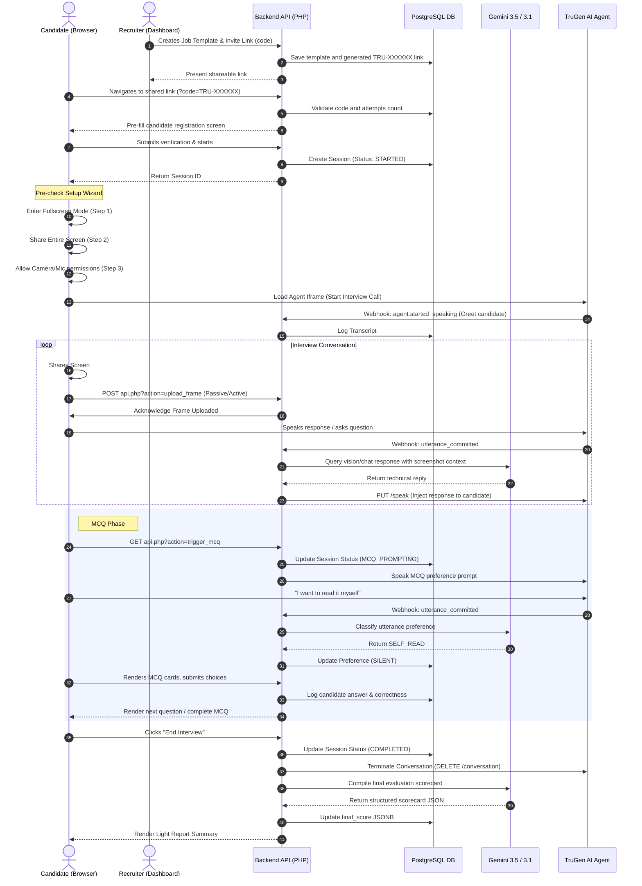

# TruInterview: AI Multimodal Technical Interviewer & Screening Platform

TruInterview is a robust, interactive, web-based technical assessment and screening platform. It leverages the **Gemini 3.5 & 3.1 Family** (via cURL integrations) and **TruGen.ai** to deliver real-time audio interviews, monitor candidate screen sharing, evaluate code submissions via AI vision, administer interactive multiple-choice tests, and generate comprehensive evaluation dashboards for both recruiters and candidates.

The application follows a lightweight, server-side design pattern requiring **no build or compilation step**, utilizing standard vanilla web technologies (HTML5, Vanilla CSS3, ES6+ JavaScript, PHP, and PostgreSQL) for direct execution.

---

## 🌟 Key Features

*   **Premium Split-Screen Authentication**: Beautiful, full-bleed split layouts for registration and login. Features light glassmorphism styling, a "Back to Home" navigation button, role-specific dynamic backgrounds/copy, and integrated **"Sign in with Google"** OAuth with a dynamic first-time user role-selection workflow.
*   **Dual Dashboards & Role-based Access**:
    *   **Candidate Dashboard**: Features self-practice sessions, historic assessment run metrics, screening code redemption, private score reports, and a **Settings** tab allowing candidates to save custom Gemini API keys and default practice run task models.
    *   **Recruiter Dashboard**: Allows generating customized template configurations, distributing expiring invite codes (`TRU-XXXXXX`), managing candidate pipelines, and a **Settings** tab to configure custom TruGen Agent IDs, custom Gemini API keys, and map dialogue, vision, and evaluation tasks to specific models.
*   **Real-Time Audio Interview Agent**: Live conversational interview flow powered by a TruGen AI agent iframe, dynamically embedded within a clean user interface.
*   **Pre-Interview Security Setup Wizard**: A strict linear environment check wizard that verifies browser support (Chrome, Chromium, Safari), enforces fullscreen mode, validates entire desktop screen sharing, and requests webcam/mic permissions step-by-step before dynamically loading the TruGen AI agent. Prevents concurrent sessions and permission overlay conflicts.
*   **Intelligent Screen Context Sharing**: Periodic passive screen capturing (every 9 seconds) or active "Submit Code" snapshotting. The application captures screen contents into a high-resolution frame for AI vision-based analysis.
*   **Automated Candidate Conduct Monitoring**: Leverages Gemini function calling to track candidate focus and professional conduct. Inappropriate or off-topic dialogue triggers formal system warnings, leading to automated session termination after two warnings.
*   **Interactive MCQ Assessment**: Dynamically shifts status to trigger multiple-choice questions. Uses Gemini to classify voice intents for reading preferences (e.g., read aloud vs. self-read) and to extract selected options (A, B, C, or D) from candidate utterances.
*   **Clean Light-Mode Aesthetic**: Refined premium styling with custom variables, smooth transitions, and elegant shadow details.
*   **Automated Evaluation Reports**: Post-interview analysis detailing Communication, Problem Solving, and Code Quality metrics (graded 1–10) alongside key strengths, development areas, and a synthesized feedback summary generated by Gemini.

---

## 🛠️ Technology Stack

*   **Frontend**: HTML5, Vanilla CSS3 (Custom Properties/Variables, CSS Grid, Flexbox, custom keyframes), Vanilla JavaScript (ES6, MediaDevices API, Canvas API for capturing high-resolution screen share context).
*   **Backend**: PHP 7.4+ (cURL integration client for Gemini APIs and TruGen SDK actions, webhooks controller, database connectivity layer, custom auth validation middleware).
*   **Database**: PostgreSQL 12+ (stores session state machine variables, conversation transcripts, multiple-choice question sets, candidate responses, users, companies, templates, and link details).
*   **AI Models & Engines**:
    *   **Gemini 3.5 & 3.1 Families (Pro, Flash, Flash-Lite)**: Dynamically routes dialogue tasks, vision parsing (screen context), and grading evaluation tasks according to recruiter and candidate settings/practice overrides. Supports bring-your-own-key capability and function calling for conduct monitoring.
    *   **TruGen.ai**: Facilitates real-time low-latency video/audio interview streams, audio transcription hook triggers, and TTS (Text-to-Speech) conversational injections. Supports custom TruGen agent setups.

---

## 📐 Architecture & Flow

The lifecycle of an assessment invite or practice run progresses through the following flow:



---

## 🗄️ Database Schema

The database setup runs automatically on load via `db.php` if tables do not exist. 

### 1. `users`
Stores user profile accounts.
*   `id` (UUID, PK): Unique identifier.
*   `email` (VARCHAR, Unique): Login address.
*   `password_hash` (VARCHAR): Securely hashed password string.
*   `role` (VARCHAR): User type (`candidate`, `recruiter`).
*   `full_name` (VARCHAR): Display name.
*   `custom_gemini_api_key` (VARCHAR): Bring-your-own Gemini API key.
*   `custom_trugen_agent_id` (VARCHAR): Custom TruGen agent ID (recruiter only).
*   `model_chat_task` (VARCHAR): Dialogue (chat) task model preference.
*   `model_vision_task` (VARCHAR): Screen context (vision) task model preference.
*   `model_eval_task` (VARCHAR): Evaluation (grading) task model preference.
*   `created_at` (TIMESTAMP): Signup date.
*   `last_login_at` (TIMESTAMP): Last login timestamp.

### 2. `companies`
Stores recruiter corporate entities.
*   `id` (UUID, PK): Unique identifier.
*   `name` (VARCHAR): Corporate name.
*   `domain` (VARCHAR): Business domain name.
*   `created_by` (UUID, FK): Owning recruiter ID.
*   `created_at` (TIMESTAMP): Organization creation date.

### 3. `company_members`
Maps users to companies.
*   `id` (SERIAL, PK): Auto-increment ID.
*   `company_id` (UUID, FK): Associated company.
*   `user_id` (UUID, FK): Associated user.
*   `role` (VARCHAR): Role inside company (e.g. `admin`, `member`).

### 4. `interview_templates`
Stores job profiles and assessment rubrics.
*   `id` (UUID, PK): Unique identifier.
*   `company_id` (UUID, FK): Associated company.
*   `title` (VARCHAR): Title (e.g., "Senior Frontend Engineer").
*   `description` (TEXT): Assessment details.
*   `job_role` (VARCHAR): Career field target.
*   `topics` (JSONB): Assessment topics list.
*   `difficulty` (VARCHAR): Level (`easy`, `medium`, `hard`).
*   `duration_minutes` (INT): Active countdown duration.
*   `custom_system_prompt` (TEXT): Guidelines sent to the Gemini interviewer.

### 5. `interview_links`
Stores shareable invitations codes.
*   `id` (UUID, PK): Unique identifier.
*   `template_id` (UUID, FK): Target assessment blueprint.
*   `company_id` (UUID, FK): Issuing company.
*   `code` (VARCHAR, Unique): `TRU-XXXXXX` format code.
*   `candidate_email` (VARCHAR): Restrictive candidate email.
*   `candidate_name` (VARCHAR): Restrictive candidate name.
*   `max_attempts` (INT): Allowed session attempts.
*   `attempts_used` (INT): Logged candidate attempts.
*   `expires_at` (TIMESTAMP): Expiry cutoff.
*   `status` (VARCHAR): Code status (`active`, `inactive`).

### 6. `sessions`
Tracks candidate metadata, ongoing state, and evaluation results.
*   `id` (UUID, PK): Unique identifier.
*   `candidate_name` (VARCHAR): Candidate name.
*   `email` (VARCHAR): Candidate email.
*   `current_status` (VARCHAR): State (`STARTED`, `IN_PROGRESS`, `MCQ_PROMPTING`, `MCQ_ACTIVE`, `COMPLETED`, `TERMINATING`).
*   `mcq_preference` (VARCHAR): MCQ reading settings (`PENDING`, `READ`, `SILENT`).
*   `trugen_conversation_id` (VARCHAR): Connected conversation identifier returned by TruGen AI.
*   `conduct_warnings` (INT): Formal conduct warning counter.
*   `closure_reason` (VARCHAR): Reason for session ending (e.g. `'misconduct'`).
*   `started_at` (TIMESTAMP): Creation timestamp.
*   `completed_at` (TIMESTAMP): Completion timestamp.
*   `final_score` (JSONB): Final Gemini evaluation JSON.
*   `user_id` (UUID, FK): Optional registered candidate ID.
*   `interview_link_id` (UUID, FK): Optional recruiter invite code reference.
*   `template_id` (UUID, FK): Active assessment template reference.
*   `session_type` (VARCHAR): Session category (`practice`, `assessment`).
*   `model_chat_task` (VARCHAR): Chat model used for the session.
*   `model_vision_task` (VARCHAR): Vision model used for the session.
*   `model_eval_task` (VARCHAR): Evaluation model used for the session.

### 7. `transcripts`
Logs every turn of the conversational stream.
*   `id` (SERIAL, PK): Auto-increment ID.
*   `session_id` (UUID, FK): Associated session.
*   `speaker` (VARCHAR): Sender role (`SYSTEM`, `USER`, `AGENT`).
*   `message` (TEXT): Spoken content or system notification.
*   `timestamp` (TIMESTAMP): Event recording time.

### 8. `mcq_questions`
Static repository of technical assessment questions.
*   `id` (SERIAL, PK): Auto-increment ID.
*   `topic` (VARCHAR): Coding subject (e.g. `JavaScript`, `CSS`, `PHP`).
*   `question` (TEXT): The main question statement.
*   `option_a`, `option_b`, `option_c`, `option_d` (TEXT): Multi-choice selections.
*   `correct_option` (CHAR): Correct selection code (`A`, `B`, `C`, or `D`).

### 9. `candidate_responses`
Logs MCQ choices made by the candidate.
*   `id` (SERIAL, PK): Auto-increment ID.
*   `session_id` (UUID, FK): Associated session.
*   `question_id` (INT, FK): Associated MCQ question.
*   `selected_option` (CHAR): Selected answer option.
*   `is_correct` (BOOLEAN): Score verification flag.
*   `submitted_at` (TIMESTAMP): Time of submission.

---

## 🔌 API Endpoints (`api.php`)

All API interactions accept and return `application/json` payload types.

| Endpoint Action | Method | Query Parameters | Body Parameter | Description |
| :--- | :--- | :--- | :--- | :--- |
| `?action=start` | **POST** | *None* | `name`, `email` | Creates a new session, sets a cookie, and logs session startup. |
| `?action=status` | **GET** | `session_id` | *None* | Returns the session details and transcripts history list. |
| `?action=upload_frame` | **POST** | *None* | `session_id` (optional), `frame` (base64) | Writes candidate screenshot (`uploads/<session_id>/latest.jpg`) to disk. |
| `?action=trigger_mcq` | **GET** | `session_id` | *None* | Transitions session to MCQ prompting and speaks instructions. |
| `?action=get_mcq_state` | **GET** | `session_id` | *None* | Returns active question details if MCQ status is ongoing. |
| `?action=submit_option` | **POST** | *None* | `session_id`, `question_id`, `option` | Evaluates, logs response, and queues next question or finishes flow. |
| `?action=complete` | **GET** | `session_id` | *None* | Terminates streams and fetches final Gemini score details. |
| `?action=webhook` | **POST** | *None* | *Webhook payload* | Processes TruGen events (`agent.started_speaking`, `agent.stopped_speaking`, `utterance_committed`, `call_ended`). |

---

## ⚙️ Environment Configuration

Define a `.env` file in the root directory to store database connection details and AI service API keys:

```env
# Database Credentials
DB_HOST=127.0.0.1
DB_PORT=5432
DB_NAME=truinterview
DB_USER=your_postgres_user
DB_PASSWORD=your_postgres_password

# API Credentials
GEMINI_API_KEY=your_gemini_api_key
TRUGEN_API_KEY=your_trugen_api_key
TRUGEN_AGENT_ID=your_trugen_agent_id
GOOGLE_CLIENT_ID=your_google_client_id.apps.googleusercontent.com

```

---

## 🚀 Installation & Setup

1.  **Clone the Repository**:
    ```bash
    git clone https://github.com/your-username/truinterview.git
    cd truinterview
    ```

2.  **Configure Database**:
    Ensure PostgreSQL is running and create a database corresponding to `DB_NAME` in your `.env` configuration.
    ```sql
    CREATE DATABASE truinterview;
    ```
    *Note: The schema will be automatically generated and populated with default seed questions on the first application reload.*

3.  **Deploy Env File**:
    Create a `.env` file in the root directory utilizing the environment template keys shown in the configuration section.

4.  **Launch Server**:
    Since this is a standard PHP/JavaScript project without a compilation pipeline, host the directory using any PHP-compatible web server (e.g. Apache, Nginx, or PHP's built-in development server):
    ```bash
    php -S localhost:8000
    ```

5.  **Access App**:
    Open [http://localhost:8000](http://localhost:8000) in your browser to start.

---

## 📖 Development Guidelines

1.  **No Build Step**: Write clean HTML5, standard ES6+ JavaScript, and native CSS3 variables. Do not introduce compile dependencies.
2.  **Multimodal Integrations**: Custom prompt guidelines are mapped inside `ai_service.php`. Ensure TTS instructions filter markdown elements and emojis when sending injected speech.
3.  **Database Seeding**: Check `db.php` if additional mock MCQ questions require additions.