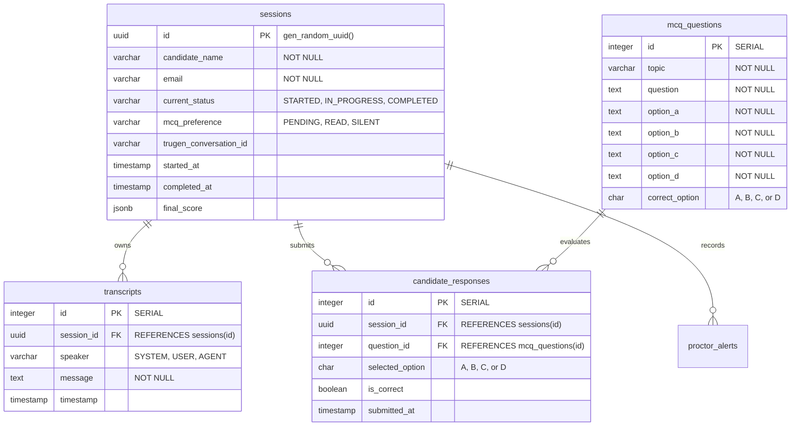

# TruInterview Database Schema

This document provides a detailed overview of the PostgreSQL tables, fields, types, and constraints configured in the TruInterview application.

---

## Entity Relationship Summary

---

## Tables Detail

### 1. `sessions`
Stores metadata and progress context for each interview attempt.

| Field Name | Data Type | Constraints / Default | Description |
| :--- | :--- | :--- | :--- |
| `id` | `UUID` | `PRIMARY KEY`, Default `gen_random_uuid()` | Unique session identifier. |
| `candidate_name` | `VARCHAR(100)` | `NOT NULL` | Full name of the candidate. |
| `email` | `VARCHAR(100)` | `NOT NULL` | Email address of the candidate. |
| `current_status` | `VARCHAR(20)` | Default `'STARTED'` | Status state machine: `STARTED`, `IN_PROGRESS`, `COMPLETED`. |
| `mcq_preference` | `VARCHAR(15)` | Default `'PENDING'` | Candidate preference for reading MCQs: `PENDING`, `READ`, `SILENT`. |
| `trugen_conversation_id` | `VARCHAR(100)` | `NULL` | Connected conversation identifier returned by TruGen AI SDK. |
| `started_at` | `TIMESTAMP WITH TIME ZONE` | Default `CURRENT_TIMESTAMP` | Time the session was created. |
| `completed_at` | `TIMESTAMP WITH TIME ZONE` | `NULL` | Time the session ended and evaluation finished. |
| `final_score` | `JSONB` | `NULL` | Aggregated scoring metrics and breakdown feedback. |

---

### 2. `transcripts`
Logs all conversational turns (candidate speech, system updates, and interviewer responses).

| Field Name | Data Type | Constraints / Default | Description |
| :--- | :--- | :--- | :--- |
| `id` | `INTEGER` | `PRIMARY KEY`, `SERIAL` | Auto-incrementing identifier. |
| `session_id` | `UUID` | `FOREIGN KEY REFERENCES sessions(id) ON DELETE CASCADE` | Associated candidate session. |
| `speaker` | `VARCHAR(20)` | `NOT NULL` | Role of speaker: `SYSTEM`, `USER`, or `AGENT`. |
| `message` | `TEXT` | `NOT NULL` | The spoken transcript or system event description. |
| `timestamp` | `TIMESTAMP WITH TIME ZONE` | Default `CURRENT_TIMESTAMP` | Time the event was recorded. |

---

### 3. `mcq_questions`
Static pool of evaluation questions. Seeding occurs automatically if empty.

| Field Name | Data Type | Constraints / Default | Description |
| :--- | :--- | :--- | :--- |
| `id` | `INTEGER` | `PRIMARY KEY`, `SERIAL` | Auto-incrementing identifier. |
| `topic` | `VARCHAR(50)` | `NOT NULL` | Category/topic area (e.g., `JavaScript`, `CSS`, `PHP`). |
| `question` | `TEXT` | `NOT NULL` | Prompt/Question text displayed to the user. |
| `option_a` | `TEXT` | `NOT NULL` | Multiple choice Option A text. |
| `option_b` | `TEXT` | `NOT NULL` | Multiple choice Option B text. |
| `option_c` | `TEXT` | `NOT NULL` | Multiple choice Option C text. |
| `option_d` | `TEXT` | `NOT NULL` | Multiple choice Option D text. |
| `correct_option` | `CHAR(1)` | `NOT NULL` | Correct answer key (`A`, `B`, `C`, or `D`). |

---

### 4. `candidate_responses`
Tracks user answers to MCQ questions during the interview.

| Field Name | Data Type | Constraints / Default | Description |
| :--- | :--- | :--- | :--- |
| `id` | `INTEGER` | `PRIMARY KEY`, `SERIAL` | Auto-incrementing identifier. |
| `session_id` | `UUID` | `FOREIGN KEY REFERENCES sessions(id) ON DELETE CASCADE` | Associated candidate session. |
| `question_id` | `INTEGER` | `FOREIGN KEY REFERENCES mcq_questions(id)` | Associated question item. |
| `selected_option` | `CHAR(1)` | `NULL` | Selected answer option (`A`, `B`, `C`, or `D`). |
| `is_correct` | `BOOLEAN` | `NULL` | Computed correctness state. |
| `submitted_at` | `TIMESTAMP WITH TIME ZONE` | Default `CURRENT_TIMESTAMP` | Time response was received. |

---

### 5. `proctor_alerts`
Logs proctoring events triggered by the client-side detection or verified by Gemini Vision.

| Field Name | Data Type | Constraints / Default | Description |
| :--- | :--- | :--- | :--- |
| `id` | `INTEGER` | `PRIMARY KEY`, `SERIAL` | Auto-incrementing identifier. |
| `session_id` | `UUID` | `FOREIGN KEY REFERENCES sessions(id) ON DELETE CASCADE` | Associated candidate session. |
| `alert_type` | `VARCHAR(50)` | `NOT NULL` | Type of detection anomaly (`no_face`, `multiple_faces`, `gaze_away`, `face_changed`). |
| `severity` | `VARCHAR(20)` | Default `'warning'` | Severity of the alert (`info`, `warning`, `critical`). |
| `client_details` | `JSONB` | `NULL` | JSON metadata from the client-side detection (e.g., face count, gaze position, absent duration). |
| `snapshot_path` | `VARCHAR(500)` | `NULL` | Relative path to the stored JPEG snapshot image. |
| `ai_verdict` | `TEXT` | `NULL` | Gemini Vision model's analysis explanation. |
| `ai_confirmed` | `BOOLEAN` | `NULL` | Indicates whether the Gemini Vision model confirmed the anomaly. |
| `created_at` | `TIMESTAMP WITH TIME ZONE` | Default `CURRENT_TIMESTAMP` | Time the alert was logged. |

---

### 6. `categories`
Stores categories information for different topics or interview paths.

| Field Name | Data Type | Constraints / Default | Description |
| :--- | :--- | :--- | :--- |
| `uuid` | `UUID` | `PRIMARY KEY`, Default `gen_random_uuid()` | Unique category identifier. |
| `name` | `VARCHAR(255)` | `NOT NULL` | Name of the category. |
| `description` | `TEXT` | `NULL` | Detailed description of the category. |

