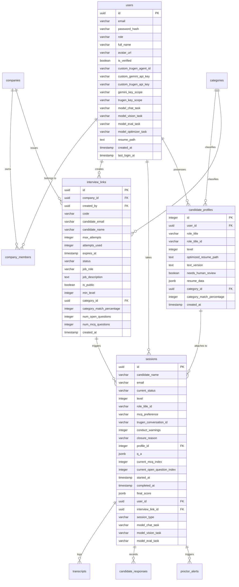

# TruInterview Database Schema

This document provides a detailed overview of the PostgreSQL tables, fields, types, and constraints configured in the TruInterview application.

---

## Entity Relationship Summary

---

## Tables Detail

### 1. `users`
Stores user profile accounts (recruiters and candidates) and custom configuration scopes.

| Field Name | Data Type | Constraints / Default | Description |
| :--- | :--- | :--- | :--- |
| `id` | `UUID` | `PRIMARY KEY`, Default `gen_random_uuid()` | Unique identifier. |
| `email` | `VARCHAR(255)` | `UNIQUE NOT NULL` | Login email address. |
| `password_hash` | `VARCHAR(255)` | `NOT NULL` | Securely hashed password. |
| `role` | `VARCHAR(20)` | `NOT NULL` | Role type (`candidate`, `recruiter`). |
| `full_name` | `VARCHAR(150)` | `NOT NULL` | User's full name. |
| `avatar_url` | `VARCHAR(500)` | `NULL` | Avatar image URL. |
| `is_verified` | `BOOLEAN` | Default `TRUE` | Profile verification state. |
| `custom_trugen_agent_id` | `VARCHAR(100)` | `NULL` | Bring-your-own TruGen agent ID. |
| `custom_gemini_api_key` | `VARCHAR(255)` | `NULL` | Bring-your-own Gemini API key. |
| `custom_trugen_api_key` | `VARCHAR(255)` | `NULL` | Bring-your-own TruGen API key. |
| `gemini_key_scope` | `VARCHAR(50)` | Default `'invite_only'` | Visibility scope (`invite_only`, `everywhere`). |
| `trugen_key_scope` | `VARCHAR(50)` | Default `'invite_only'` | Visibility scope (`invite_only`, `everywhere`). |
| `model_chat_task` | `VARCHAR(50)` | Default `'gemini-3.1-flash-lite'` | Custom chat model override. |
| `model_vision_task` | `VARCHAR(50)` | Default `'gemini-3.1-flash-lite'` | Custom vision model override. |
| `model_eval_task` | `VARCHAR(50)` | Default `'gemini-3.1-flash-lite'` | Custom evaluation model override. |
| `model_optimizer_task`| `VARCHAR(50)` | Default `'gemini-3.5-flash'` | Custom optimizer model override. |
| `resume_path` | `TEXT` | `NULL` | List of V1 uploaded candidate resumes (JSON). |
| `created_at` | `TIMESTAMP WITH TZ` | Default `CURRENT_TIMESTAMP` | Signup timestamp. |
| `last_login_at` | `TIMESTAMP WITH TZ` | `NULL` | Last login timestamp. |

---

### 2. `companies`
Stores company entities owned by recruiters.

| Field Name | Data Type | Constraints / Default | Description |
| :--- | :--- | :--- | :--- |
| `id` | `UUID` | `PRIMARY KEY`, Default `gen_random_uuid()` | Unique identifier. |
| `name` | `VARCHAR(200)` | `NOT NULL` | Corporate name. |
| `domain` | `VARCHAR(200)` | `NULL` | Corporate domain. |
| `logo_url` | `VARCHAR(500)` | `NULL` | Company logo image URL. |
| `created_by` | `UUID` | `REFERENCES users(id) ON DELETE SET NULL` | Recruiter who registered the company. |
| `created_at` | `TIMESTAMP WITH TZ` | Default `CURRENT_TIMESTAMP` | Registration date. |

---

### 3. `company_members`
Maps users to companies.

| Field Name | Data Type | Constraints / Default | Description |
| :--- | :--- | :--- | :--- |
| `id` | `INTEGER` | `PRIMARY KEY`, `SERIAL` | Auto-incrementing identifier. |
| `company_id` | `UUID` | `REFERENCES companies(id) ON DELETE CASCADE` | Associated company. |
| `user_id` | `UUID` | `REFERENCES users(id) ON DELETE CASCADE` | Associated user. |
| `role` | `VARCHAR(20)` | Default `'admin'` | Membership role. |
| `joined_at` | `TIMESTAMP WITH TZ` | Default `CURRENT_TIMESTAMP` | Association timestamp. |

---

### 4. `interview_links`
Stores shareable invitation codes and assessment requirements directly.

| Field Name | Data Type | Constraints / Default | Description |
| :--- | :--- | :--- | :--- |
| `id` | `UUID` | `PRIMARY KEY`, Default `gen_random_uuid()` | Unique link ID. |
| `company_id` | `UUID` | `REFERENCES companies(id) ON DELETE CASCADE` | Associated company. |
| `created_by` | `UUID` | `REFERENCES users(id) ON DELETE SET NULL` | Recruiter who issued the link. |
| `code` | `VARCHAR(12)` | `UNIQUE NOT NULL` | Shareable code (`TRU-XXXXXX`). |
| `candidate_email` | `VARCHAR(255)` | `NULL` | Restricted candidate email validation constraint. |
| `candidate_name` | `VARCHAR(150)` | `NULL` | Restricted candidate name value. |
| `max_attempts` | `INTEGER` | Default `1` | Maximum attempts allowed. |
| `attempts_used` | `INTEGER` | Default `0` | Logged attempts. |
| `expires_at` | `TIMESTAMP WITH TZ` | `NULL` | Cutoff expiration date. |
| `status` | `VARCHAR(20)` | Default `'active'` | Active, inactive, or deleted status. |
| `job_role` | `VARCHAR(150)` | Default `'Software Engineer'` | Target role title. |
| `job_description` | `TEXT` | `NULL` | Target job description text. |
| `is_public` | `BOOLEAN` | Default `FALSE` | Toggles public candidate signup. |
| `min_level` | `INTEGER` | Default `0` | Minimum level required to start. |
| `category_id` | `UUID` | `REFERENCES categories(uuid) ON DELETE SET NULL` | Classified career category. |
| `category_match_percentage` | `INTEGER`| Default `0` | Category classification match confidence. |
| `num_open_questions` | `INTEGER` | `NULL` | Custom open-ended question count limit. |
| `num_mcq_questions` | `INTEGER` | `NULL` | Custom multiple-choice question count limit. |
| `created_at` | `TIMESTAMP WITH TZ` | Default `CURRENT_TIMESTAMP` | Issuance timestamp. |

---

### 5. `sessions`
Tracks candidate progress, metadata, proctor constraints, and scored scorecard records.

| Field Name | Data Type | Constraints / Default | Description |
| :--- | :--- | :--- | :--- |
| `id` | `UUID` | `PRIMARY KEY`, Default `gen_random_uuid()` | Session identifier. |
| `candidate_name` | `VARCHAR(100)` | `NOT NULL` | Candidate full name. |
| `email` | `VARCHAR(100)` | `NOT NULL` | Candidate email address. |
| `current_status` | `VARCHAR(20)` | Default `'STARTED'` | Progress status (`STARTED`, `IN_PROGRESS`, `MCQ_PROMPTING`, `MCQ_ACTIVE`, `COMPLETED`, `TERMINATING`). |
| `level` | `INTEGER` | Default `0` | Active level difficulty. |
| `role_title_id` | `VARCHAR(150)` | `NULL` | Active role title identifier. |
| `mcq_preference` | `VARCHAR(15)` | Default `'PENDING'` | Candidate reading setting (`PENDING`, `READ`, `SILENT`). |
| `trugen_conversation_id`| `VARCHAR(100)`| `NULL` | WebRTC voice agent conversation id. |
| `started_at` | `TIMESTAMP WITH TZ` | Default `CURRENT_TIMESTAMP` | Launch timestamp. |
| `completed_at` | `TIMESTAMP WITH TZ` | `NULL` | Completion timestamp. |
| `final_score` | `JSONB` | `NULL` | Aggregated scoring metrics breakdown. |
| `user_id` | `UUID` | `REFERENCES users(id) ON DELETE SET NULL` | Optional candidate user ID. |
| `interview_link_id` | `UUID` | `REFERENCES interview_links(id) ON DELETE SET NULL` | Optional interview link ID. |
| `session_type` | `VARCHAR(20)` | Default `'practice'` | Category (`practice`, `assessment`). |
| `model_chat_task` | `VARCHAR(50)` | Default `'gemini-3.1-flash-lite'` | Chat model used. |
| `model_vision_task` | `VARCHAR(50)` | Default `'gemini-3.1-flash-lite'` | Vision model used. |
| `model_eval_task` | `VARCHAR(50)` | Default `'gemini-3.1-flash-lite'` | Evaluation model used. |
| `conduct_warnings` | `INTEGER` | Default `0` | Total warnings issued. |
| `closure_reason` | `VARCHAR(50)` | `NULL` | Reason for premature closing (e.g., `'misconduct'`). |
| `profile_id` | `INTEGER` | `REFERENCES candidate_profiles(id) ON DELETE SET NULL` | Associated V2 candidate profile. |
| `q_a` | `JSONB` | `NULL` | Session-specific dynamic question set. |
| `current_mcq_index` | `INTEGER` | `NULL` | MCQ active index pointer. |
| `current_open_question_index`| `INTEGER` | `NULL` | Open question active index pointer. |

---

### 6. `transcripts`
Logs conversational turns (candidate speech, system alerts, voice agent replies).

| Field Name | Data Type | Constraints / Default | Description |
| :--- | :--- | :--- | :--- |
| `id` | `INTEGER` | `PRIMARY KEY`, `SERIAL` | Auto-incrementing identifier. |
| `session_id` | `UUID` | `REFERENCES sessions(id) ON DELETE CASCADE` | Associated session ID. |
| `speaker` | `VARCHAR(20)` | `NOT NULL` | Sender role (`SYSTEM`, `USER`, or `AGENT`). |
| `message` | `TEXT` | `NOT NULL` | The spoken message or status entry text. |
| `timestamp` | `TIMESTAMP WITH TZ` | Default `CURRENT_TIMESTAMP` | Recording time. |

---

### 7. `candidate_responses`
Logs MCQ options selected by the candidate during assessments.

| Field Name | Data Type | Constraints / Default | Description |
| :--- | :--- | :--- | :--- |
| `id` | `INTEGER` | `PRIMARY KEY`, `SERIAL` | Auto-incrementing identifier. |
| `session_id` | `UUID` | `REFERENCES sessions(id) ON DELETE CASCADE` | Associated session ID. |
| `question_id` | `INTEGER` | `NULL` | Refers to the question index key inside the session's `q_a` list. |
| `selected_option` | `CHAR(1)` | `NULL` | Option submitted (`A`, `B`, `C`, or `D`). |
| `is_correct` | `BOOLEAN` | `NULL` | Computed correctness state. |
| `submitted_at` | `TIMESTAMP WITH TZ` | Default `CURRENT_TIMESTAMP` | Submission timestamp. |

---

### 8. `proctor_alerts`
Logs focus anomalies, tab switches, or vision anomalies verified by Gemini Vision.

| Field Name | Data Type | Constraints / Default | Description |
| :--- | :--- | :--- | :--- |
| `id` | `INTEGER` | `PRIMARY KEY`, `SERIAL` | Auto-incrementing identifier. |
| `session_id` | `UUID` | `REFERENCES sessions(id) ON DELETE CASCADE` | Associated session ID. |
| `alert_type` | `VARCHAR(50)` | `NOT NULL` | Telemetry anomaly type (`no_face`, `tab_switch`, `fullscreen_exit`, `gaze_away`). |
| `severity` | `VARCHAR(20)` | Default `'warning'` | Severity tier (`info`, `warning`, `critical`). |
| `client_details` | `JSONB` | `NULL` | Extracted client-side detection telemetry info. |
| `snapshot_path` | `VARCHAR(500)` | `NULL` | Relational path to the verification snapshot. |
| `ai_verdict` | `TEXT` | `NULL` | Gemini Vision analysis statement. |
| `ai_confirmed` | `BOOLEAN` | `NULL` | Toggles if Gemini Vision validated the anomaly. |
| `created_at` | `TIMESTAMP WITH TZ` | Default `CURRENT_TIMESTAMP` | Alert timestamp. |

---

### 9. `candidate_profiles`
Manages distinct candidate career tracks and unlocked progress stats (Candidate V2).

| Field Name | Data Type | Constraints / Default | Description |
| :--- | :--- | :--- | :--- |
| `id` | `INTEGER` | `PRIMARY KEY`, `DEFAULT nextval('candidate_profiles_id_seq')` | Auto-incrementing profile ID. |
| `user_id` | `UUID` | `REFERENCES users(id) ON DELETE CASCADE` | Owner user. |
| `role_title` | `VARCHAR(150)` | `NOT NULL` | Job role name (e.g. `"PHP Developer"`). |
| `role_title_id` | `VARCHAR(150)` | `NULL` | Formatted role ID string (e.g. `"PHP-Developer"`). |
| `level` | `INTEGER` | Default `0` | Unlocked level tier (0 to pass, increments on $\ge$ 60% evaluation score). |
| `optimized_resume_path`| `TEXT` | `NULL` | Path to generated optimized resume markdown. |
| `text_version` | `TEXT` | `NULL` | Resume text body representation. |
| `needs_human_review` | `BOOLEAN` | Default `FALSE` | Requires recruiter manual verification flags. |
| `resume_data` | `JSONB` | `NULL` | Resume metadata, dates, history logs, gaps, etc. |
| `category_id` | `UUID` | `REFERENCES categories(uuid) ON DELETE SET NULL` | Standardized category mapping. |
| `category_match_percentage`| `INTEGER`| `NULL` | Category matching confidence score. |
| `created_at` | `TIMESTAMP WITH TZ` | Default `CURRENT_TIMESTAMP` | Creation date. |

---

### 10. `categories`
Standardized grouping taxonomy for mapping recruiter templates, candidate profiles, and links.

| Field Name | Data Type | Constraints / Default | Description |
| :--- | :--- | :--- | :--- |
| `uuid` | `UUID` | `PRIMARY KEY`, Default `gen_random_uuid()` | Unique category ID. |
| `name` | `VARCHAR(255)` | `NOT NULL` | Category name (e.g., `"Frontend Engineering"`). |
| `description` | `TEXT` | `NULL` | Domain summary details. |
